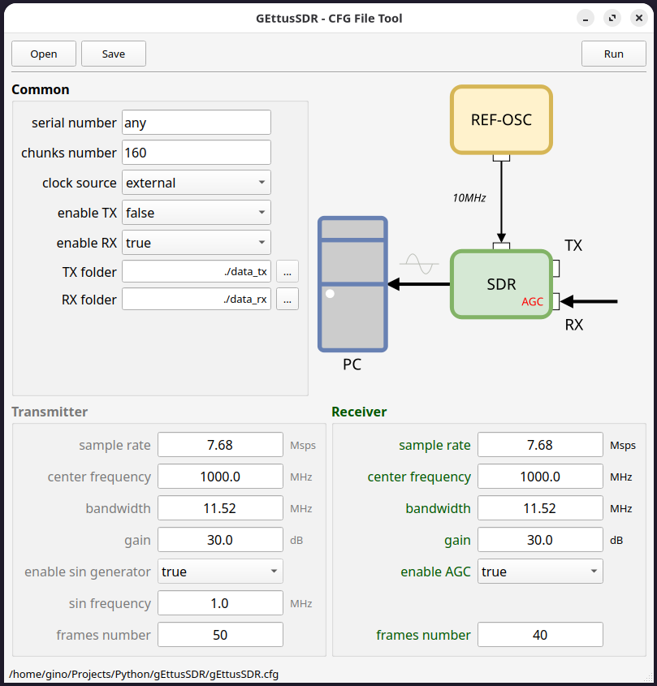
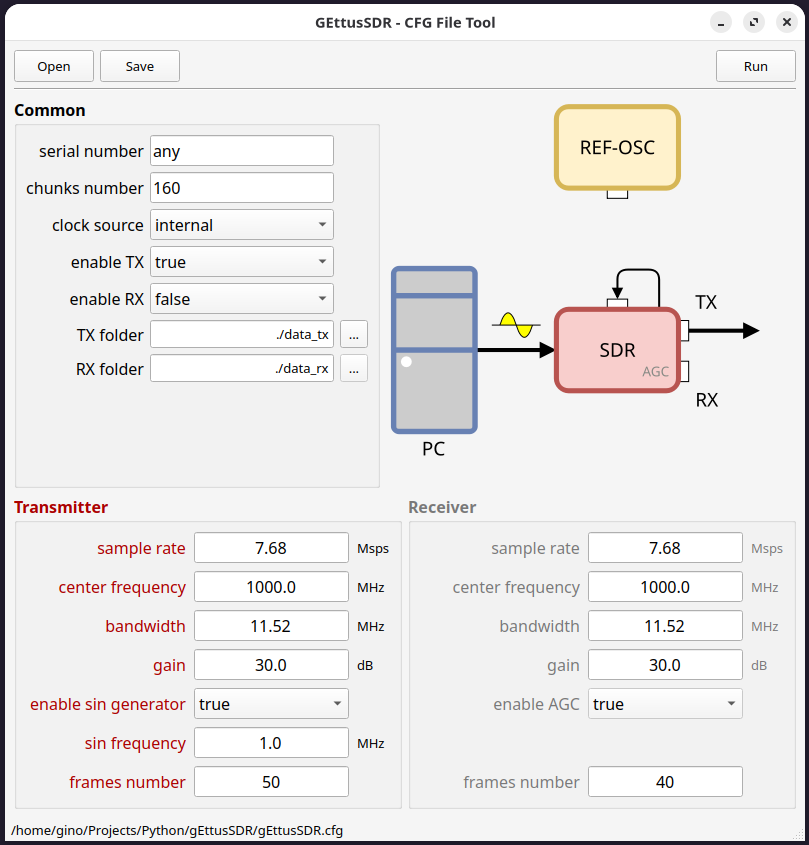
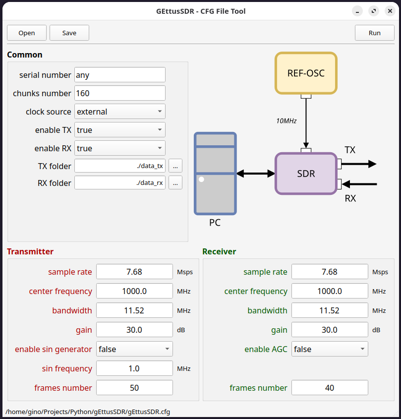

# gEttusSDR

**gEttusSDR** is a graphical user interface (GUI) application for configuring and controlling Ettus Software Defined Radio (SDR) devices. The application is built with Python and PySide2, providing an intuitive interface for SDR setup, configuration management, and task execution.









## Features

- **Configuration Management**: Load and save SDR configuration files (`.cfg`), with automatic handling of missing parameters.
- **Device Control**: Enable/disable transmit (TX) and receive (RX) functions, set sample rates, center frequencies, bandwidths, and gains for both TX and RX.
- **Folder Selection**: Easily select folders for TX and RX sample storage.
- **Test Signal Generation**: Configure and enable a sine wave generator for testing purposes. When disabled, the TX samples are loaded from the TX folder.
- **Dynamic Diagram**: Visual representation of SDR state, updated according to configuration.
- **Threaded Execution**: Runs SDR tasks in a background thread to keep the UI responsive.
- **Light Theme**: The application forces a light color theme for improved readability.

## Usage

1. **Install Requirements**:  
   Make sure you have Python 3 and PySide2 installed:
   ```
   pip install PySide2
   ```

2. **Run the Application**:  
   Execute the main script:
   ```
   python gEttusSDR.py
   ```

3. **Configure SDR**:  
   - Use the GUI to load or save configuration files.
   - Adjust SDR parameters as needed.
   - Select folders for TX/RX samples.
   - Click "Run" to start SDR tasks.

## Requirements

- Python 3.x
- PySide2

Details of the PySide2 library are available at this link:
https://pypi.org/project/PySide2/
